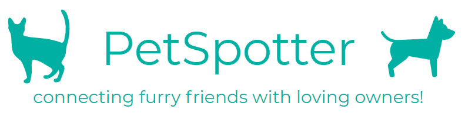

This front-end project was bootstrapped with [Create React App](https://github.com/facebook/create-react-app).

TODO Jordan:
- Make sure transactionID is an int, not a string

## Setup

If you don't already have npm installed on your machine, make sure to do so.

Navigate to the project folder.  Install React and several other dependencies:

```
npm install react
npm install react-bootstrap
npm install react-dom
```

In the project directory, you can run:

`npm start`

This runs the app in the development mode.<br>
Open [http://localhost:3000](http://localhost:3000) to view it in the browser.

The page will reload if you make edits.<br>
You will also see any lint errors in the console.

## Query Request/Response Syntax

The response from each query is expected be a Promise that resolves as a JSON object with the following format:

```
{
	code: 200 || 500, // Or some other integer code indicating a success or failure.
	body: {} || []  // A JSON object or array containing the meaningful data for the query.
}
```

The format of these queries (especially the responses) are subject to change.

### Update Client Information (Donor, Pet Owner)
```
// Request:
	{
		cPhone: string,
		cName: string,       // optional
		cEmail: string,      // optional
		cHouseNo: int,       // optional
		cStreet: string,     // optional
		city: string,        // optional
		province: string,    // optional
		cPostalCode: string, // optional
		petsOwned: int       // optional
	}

// Response:
	{
		code: 200,
		body: null
	}
```

### Make a Donation (Donor)
```
// Request:
	{
		cPhone: string,
		amount: float,
		sPhone: string,
		nameToCredit: string,
		description: string || null
	}

// Response:
	{
		code: 200,
		body: null
	}
```

### Get a Tax Receipt (Donor)
```
// Request:
	{
		cPhone: string
	}

// Response:
	{
		code: 200,
		body: {
			cName: string,
			total: float
		}
	}
```

### View All Pets (Pet owner)
```
// Request: null, just a function call

// Response:
	{
		code: 200,
		body: [
		{
			sName: string,
			aName: string,
			age: int,
			weight: float,
			gender: string, // one of "M" or "F"
			species: string,
			breed: string,
			goodWithKids: bool, // or int
			goodWithCats: bool, // or int
			goodWithDogs: bool, // or int
		},

		// More objects representing animals in the same array 
		]
	}
```

### View Pets by Shelter (Pet owner)
```
// Request:
	{
		sPhone: string
	}

// Response:
	{
		code: 200,
		body: [
		{
			aName: string,
			age: int,
			weight: float,
			gender: string, // one of "M" or "F"
			species: string,
			breed: string,
			goodWithKids: bool, // or int
			goodWithCats: bool, // or int
			goodWithDogs: bool, // or int
		},

		// More objects representing animals in the same array 
		]
	}
```

### Delete a Donation (Shelter Volunteer)
```
// Request:
	{
		transactionID: int
	}

// Response:
	{
		code: 200,
		body: null
	}
```

### View Donation Totals by Shelter (Shelter Volunteer)
```
// Request: null, just a function call

// Response:
	{
		code: 200,
		body: [
		{
			sName: "Broadway West",
			totalAmount: float,
		},
		{
			sName: "Richmond South",
			totalAmount: float,
		},
		{
			sName: "Burnaby",
			totalAmount: float,
		},
		{
			sName: "Delta",
			totalAmount: float,
		},
		{
			sName: "Surrey South",
			totalAmount: float,
		},
		]
	}
```

### View Pickup Times (Shelter Volunteer)
```
// Request: null, just a function call

// Response:
	{
		code: 200,
		body: [
		{
			sName: string,
			cName: string,
			aName: string,
			licenseNo: int,
			pickupTime: timestamp
		},
		
		// Other objects representing pickup times here
		]
	}
```

### View Preferred Donors (Shelter Volunteer)
```
// Request: null, just a function call

// Response:
	{
		code: 200,
		body: [
		{
			cName: string,
			cEmail: string,
			cPhone: string
		},
		
		// Other objects representing preferred donors here
		]
	}
```

## Other Available Scripts

### `npm test`

Launches the test runner in the interactive watch mode.<br>
See the section about [running tests](https://facebook.github.io/create-react-app/docs/running-tests) for more information.

### `npm run build`

Builds the app for production to the `build` folder.<br>
It correctly bundles React in production mode and optimizes the build for the best performance.

The build is minified and the filenames include the hashes.<br>
Your app is ready to be deployed!

See the section about [deployment](https://facebook.github.io/create-react-app/docs/deployment) for more information.

### `npm run eject`

**Note: this is a one-way operation. Once you `eject`, you can’t go back!**

If you aren’t satisfied with the build tool and configuration choices, you can `eject` at any time. This command will remove the single build dependency from your project.

Instead, it will copy all the configuration files and the transitive dependencies (Webpack, Babel, ESLint, etc) right into your project so you have full control over them. All of the commands except `eject` will still work, but they will point to the copied scripts so you can tweak them. At this point you’re on your own.

You don’t have to ever use `eject`. The curated feature set is suitable for small and middle deployments, and you shouldn’t feel obligated to use this feature. However we understand that this tool wouldn’t be useful if you couldn’t customize it when you are ready for it.

## Learn More

You can learn more in the [Create React App documentation](https://facebook.github.io/create-react-app/docs/getting-started).

To learn React, check out the [React documentation](https://reactjs.org/).

### Code Splitting

This section has moved here: https://facebook.github.io/create-react-app/docs/code-splitting

### Analyzing the Bundle Size

This section has moved here: https://facebook.github.io/create-react-app/docs/analyzing-the-bundle-size

### Making a Progressive Web App

This section has moved here: https://facebook.github.io/create-react-app/docs/making-a-progressive-web-app

### Advanced Configuration

This section has moved here: https://facebook.github.io/create-react-app/docs/advanced-configuration

### Deployment

This section has moved here: https://facebook.github.io/create-react-app/docs/deployment

### `npm run build` fails to minify

This section has moved here: https://facebook.github.io/create-react-app/docs/troubleshooting#npm-run-build-fails-to-minify
